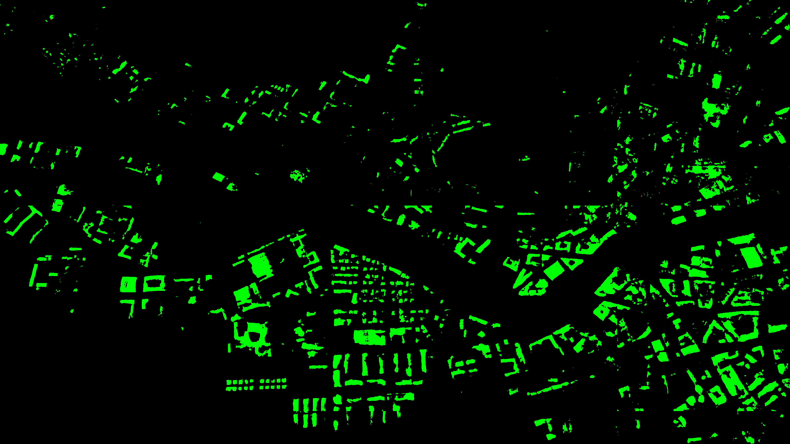

# URBAN EVOLUTION

I have trained a model with the Segformer architecture to identify buildings from satellite images and then, with a time series of images to show the urban evolution of a geographical area.

## Preliminary result:

